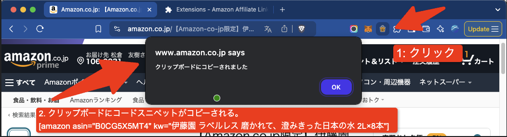
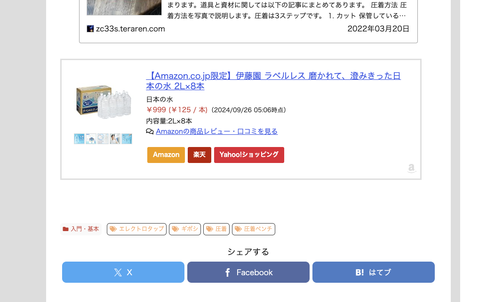
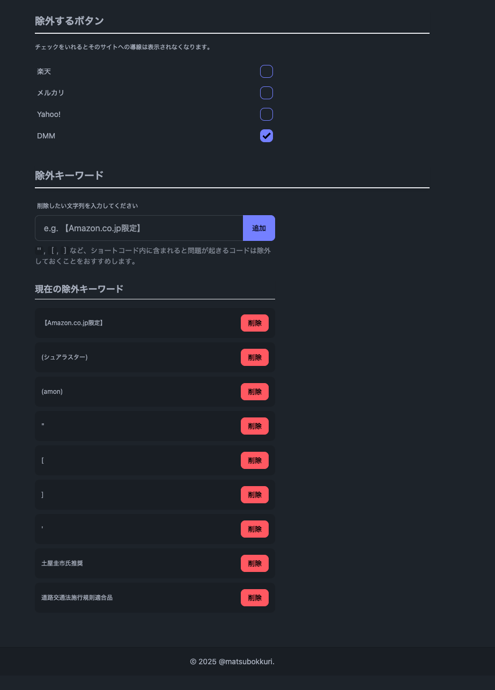
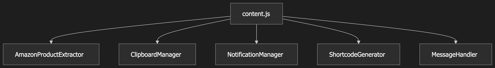

# Amazon Affiliate Link Generator for Cocoon

[](https://github.com/matsubo/cocoon-amazon-shortcode/actions/workflows/eslint.yml)

このChrome拡張機能は、WordPressの[Cocoon](https://wp-cocoon.com/)テーマを利用しているブログ向けに、Amazonの商品ページからアフィリエイトリンクをワンクリックで生成します。

<div align="center">
  
</div>

## 📋 目次

- [機能概要](#機能概要)
- [インストール方法](#インストール方法)
- [使用方法](#使用方法)
- [オプション設定](#オプション設定)
- [ショートカットキー](#ショートカットキー)
- [技術仕様](#技術仕様)
- [開発ガイド](#開発ガイド)
- [注意事項](#注意事項)
- [貢献](#貢献)
- [サポート](#サポート)

## 🚀 機能概要

- **簡単操作**: Amazonの商品ページでワンクリックでアフィリエイトコードを生成
- **Cocoon対応**: WordPressのCocoonテーマで使用できる形式でコード生成
- **カスタマイズ可能**: 商品タイトルから不要なキーワードを除外可能
- **他サイト除外**: 楽天、Yahoo!、メルカリ、DMMへの導線を非表示にする設定
- **ダークモード対応**: システム設定に合わせて自動的にテーマを切り替え

## 💾 インストール方法

Chrome Web Storeから簡単にインストールできます：

[Chrome Web Storeでインストール](https://chromewebstore.google.com/detail/amazon-affiliate-code-gen/adllmboiaanlalincjihgenhmcdggian?hl=ja)

## 📝 使用方法

1. Amazon.co.jpの商品ページにアクセスします
2. ブラウザツールバーの拡張機能アイコンをクリックします
3. 以下の形式のアフィリエイトコードが自動的にクリップボードにコピーされます：
   ```
   [amazon asin="XXXXXXXXXX" kw="商品名"]
   ```
4. WordPressの投稿画面に貼り付けるだけで完了です

### 動作例

1. Amazonの商品ページを開きます（例: https://amzn.to/3TKo9MF）
2. 拡張機能のアイコンをクリックします

   

3. 以下のようなコードがクリップボードにコピーされます：
   ```
   [amazon asin="B0CG5X5MT4" kw="伊藤園 ラベルレス 磨かれて、澄みきった日本の水 2L×8本"]
   ```

4. Cocoonテーマを使用しているWordPressに貼り付けると、以下のように表示されます：

   

## ⚙️ オプション設定

拡張機能のオプションページでは以下の設定が可能です：

1. **除外キーワード設定**: 商品タイトルから除外したいキーワードを追加できます
   - 例: `【Amazon.co.jp限定】`などの不要なフレーズを除外
2. **他サイト表示設定**: 楽天、Yahoo!、メルカリ、DMMへの導線表示を制御できます



## ⌨️ ショートカットキー

| OS | ショートカット |
|---|---|
| Windows / Linux | `Ctrl + Shift + L` |
| macOS | `Command + Shift + L` |

## 🔧 技術仕様

### 使用技術

- **言語**: TypeScript
- **スタイリング**: Tailwind CSS + daisyUI
- **ビルドツール**: npm scripts + Make

### ファイル構成

```
.
├── dist/               # コンパイル済みファイル
│   ├── src/            # TypeScriptコンパイル結果
│   ├── options/        # オプションページJS
│   └── styles/         # Tailwind CSS
├── src/                # ソースコード
│   ├── background.ts   # バックグラウンドスクリプト
│   ├── content.ts      # コンテンツスクリプト
│   └── styles/         # スタイルシート
├── options/            # オプションページ
│   ├── index.html      # オプションページHTML
│   └── options.ts      # オプションページロジック
├── manifest.json       # 拡張機能マニフェスト
├── tailwind.config.js  # Tailwind設定
└── tsconfig.json       # TypeScript設定
```

### アーキテクチャ

拡張機能は以下のモジュールで構成されています：



## 🛠️ 開発ガイド

### 開発環境のセットアップ

1. リポジトリをクローンします：
   ```bash
   git clone https://github.com/matsubo/cocoon-amazon-shortcode.git
   cd cocoon-amazon-shortcode
   ```

2. 依存関係をインストールします：
   ```bash
   npm install
   ```

3. 開発ビルドを実行します：
   ```bash
   make dev
   ```

### ビルドコマンド

| コマンド | 説明 |
|---|---|
| `make build` | TypeScriptとTailwind CSSをコンパイル |
| `make package` | ビルドして配布用ZIPファイルを作成 |
| `make dev` | 開発モードでTypeScriptコンパイラを実行 |
| `make clean` | ビルド成果物を削除 |
| `npm run lint` | ESLintでコードをチェック |

### Chromeへのインストール方法（開発版）

1. `chrome://extensions/` にアクセスします
2. 「デベロッパーモード」を有効にします
3. 「パッケージ化されていない拡張機能を読み込む」をクリックします
4. プロジェクトのディレクトリを選択します

## ⚠️ 注意事項

- この拡張機能はAmazon.co.jpの商品ページでのみ動作します
- Amazonのアフィリエイトプログラムの利用規約を遵守してください
- Amazonのウェブサイト構造が変更された場合、拡張機能の更新が必要になる場合があります

## 👥 貢献

貢献は大歓迎です！以下の方法で貢献できます：

1. バグ報告や機能リクエストはIssueで提出してください
2. コード改善はPull Requestを送信してください
3. コードを修正する前に `npm run lint` を実行してください

## 🙏 サポート

この拡張機能が役立ったと思われましたら、以下の方法でサポートいただけると嬉しいです：

- [Amazon欲しいものリスト](https://www.amazon.jp/hz/wishlist/ls/1Y9PUK3OZYI5M?ref_=wl_share)
- [Buy Me A Coffee](https://buymeacoffee.com/matsubokkuri)

---

© 2025 [matsubokkuri](https://x.com/matsubokkuri)
