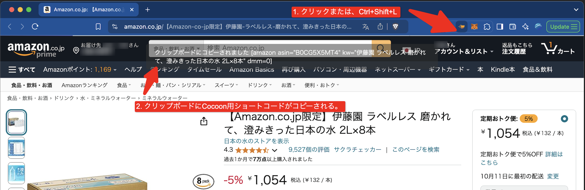
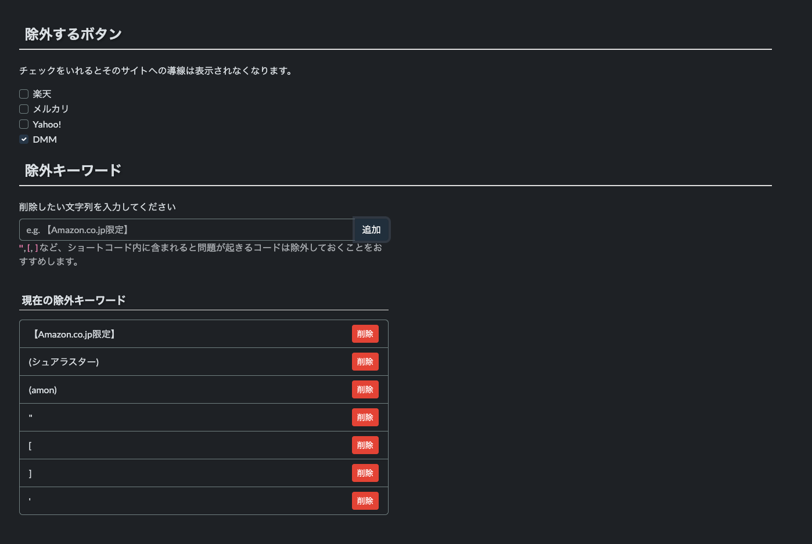

# Amazon Affiliate Link Generator Chrome Extension for Cocoon

[](https://github.com/matsubo/cocoon-amazon-shortcode/actions/workflows/eslint.yml)


このChrome拡張機能は、Wordpressの[Cocoon](https://wp-cocoon.com/)テーマを利用しているWordpress用に
Amazonの商品ページのアフィリエイトリンクをワンクリックで生成します。

## 特徴

- Amazonの商品ページを自動的に検出
- アフィリエイトコードスニペットを次の形式で生成: `[amazon asin="<asin>" kw="<商品名>"]`
- 生成されたコードをクリップボードにコピー
- Amazon.co.jpドメインで動作

## インストール

1. このリポジトリをクローンするか、ZIPファイルをダウンロードして解凍します。
2. Google Chromeを開き、`chrome://extensions/`に移動します。
3. 右上の「デベロッパーモード」を有効にします。
4. 「パッケージ化されていない拡張機能を読み込む」をクリックし、拡張機能ファイルが含まれるディレクトリを選択します。

## 使用方法

1. Amazon.co.jpの商品のページに移動します。
2. Chromeのツールバーにある拡張機能アイコンをクリックします。
3. アフィリエイトコードが自動的に生成され、クリップボードにコピーされます。
4. 必要な場所にコードを貼り付けます。

## 動作例

以下の商品ページを開きます。
https://amzn.to/3TKo9MF

ブラウザ拡張のボタンをクリックします。




以下のようなコードがコピーされます。

`[amazon asin="B0CG5X5MT4" kw="伊藤園 ラベルレス 磨かれて、澄みきった日本の水 2L×8本"]`


Cocoonのテーマを使っているWordpressにそのまま貼り付けると以下のように表示されます。


この拡張のオプションページでは、タイトルから指定したキーワードを除外できます。
たとえば、 `【Amazon.co.jp限定】` というフレーズが商品タイトルに入っていますが商品名では無いので除去します。



## ショートカットキー

Windows, Linux
```
Ctrl + Shift + L
```

mac
```
Command + Shift + L
```

## ファイル構成

- `manifest.json`: 拡張機能の設定ファイル
- `content.js`: Amazonの商品ページとやり取りするコンテントスクリプト
- `icon.png`: 拡張機能アイコン（48x48ピクセル）

## 開発

この拡張機能を変更または拡張するには:

1. 関連するファイルに変更を加えます。
2. 新しい権限や機能を追加する場合は、`manifest.json`ファイルを更新します。
3. `chrome://extensions/`ページで拡張機能をリロードします。

## 注意事項

- この拡張機能はAmazon.co.jpの商品ページでのみ動作します。
- この拡張機能を使用する際は、Amazonのアフィリエイトプログラムの利用規約を遵守してください。
- Amazonがウェブサイトの構造を変更した場合、拡張機能の更新が必要になることがあります。

## 貢献

貢献は歓迎します！プルリクエストを提出してください。

## 応援

もし役に立ったと思ったら、応援お願いします！

https://www.amazon.jp/hz/wishlist/ls/1Y9PUK3OZYI5M?ref_=wl_share


コーヒー飲みたい。
https://buymeacoffee.com/matsubokkuri
